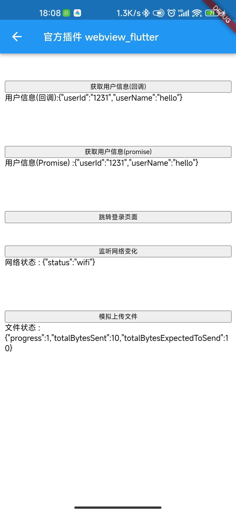

# flutter webview jsbridge

flutter webview js端与flutter端的交互

目前 flutter 相关的 jsbridge 也有很多,  本库也参考了许多前辈的写法，并且自己做了一些封装, 提供了一些其他库没有的方法,
也有一些自己的封装思路, 如果读者有其他的想法和建议，欢迎交流

如果只想支持官方插件 `webview_flutter` , 那么只需要删除 `lib/inapp_webview` 整个目录的代码

暂不支持发布到pub.dev, 也许后期会

#### Feat

 - `flutter 3.3.10`
 - 支持 `flutter_inappwebview: ^6.0.0-beta.22` 和 `webview_flutter: ^4.0.1`
 - `context`,`mounted`上下文感知
 - 支持 `回调` 和 `promise` 写法
 - 支持 `js` 监听 `flutter` 方法
 - 提供简单的 js 压缩打包的脚本 `assets/webpack.config.js`


#### Example

`assets/index.html`

#### preview



```html
<!DOCTYPE html>
<html>

<head>
    <meta charset="utf-8">
    <meta name="viewport"
          content="width=device-width, initial-scale=1.0, maximum-scale=1.0, minimum-scale=1.0, user-scalable=no">
    <title>jssdkTest</title>
    <script type="text/javascript" src="jssdk.js"></script>
    <style>
        span {
            display:inline-block;
            word-break:break-word;
        }
    </style>
    <script>

        //获取用户信息
        function getUserInfoCallback() {
            JSSDK.getUserInfo({
                success: function (res) {
                    document.getElementById("user_info_callback").innerHTML = "用户信息(回调):" + JSON.stringify(res);
                }
            });
        }

        //获取用户信息(Promise)
        function getUserInfo() {
            JSSDK.getUserInfo({}).then(function (res) {
                document.getElementById("user_info").innerHTML = "用户信息(Promise) :" + JSON.stringify(res);
            });
        }

        //跳转登录
        function login() {
            JSSDK.login({});
        }

        //监听网络变化
        function onNetworkStatusChange() {
            JSSDK.onNetworkStatusChange((res) => {
                document.getElementById("network_status").innerHTML = "网络状态 : " + JSON.stringify(res);
            });
        }

        //模拟上传文件
        function onUploadFile() {
            var uploadTask = JSSDK.uploadFile({
               url: 'https://www.example.com/upload', //仅为示例，并非真实接口地址。
               filePath: '/path/to/file',
            });

            uploadTask.onProgressUpdate((res) => {
                console.log('上传进度' + res.progress);
                console.log('已经上传的数据长度' + res.totalBytesSent);
                console.log('预期需要上传的数据总长度' + res.totalBytesExpectedToSend);
                document.getElementById("upload_file").innerHTML = "文件状态 : " + JSON.stringify(res);

                // 测试条件，取消上传任务。
                if (res.progress > 50) {
                    uploadTask.abort();
                }
            });
        }


    </script>
</head>

<body>
<div style="display:flex; flex-direction: column">
    <br>
    <button style="margin-top: 20px" onclick="getUserInfoCallback()">获取用户信息(回调)</button>
    <span id="user_info_callback">用户信息(回调) : </span><br><br>

    <br>
    <button style="margin-top: 20px" onclick="getUserInfo()">获取用户信息(promise)</button>
    <span id="user_info">用户信息(Promise) : </span><br><br>

    <br>
    <button style="margin-top: 20px" onclick="login()">跳转登录页面</button>
    <br>
    <button style="margin-top: 20px" onclick="onNetworkStatusChange()">监听网络变化</button>
    <span id="network_status">监听网络状态: </span><br><br>

    <br>
    <button style="margin-top: 20px" onclick="onUploadFile()">模拟上传文件</button>
    <span id="upload_file">上传文件状态: </span><br><br>
    <br>
</div>
</body>

```


